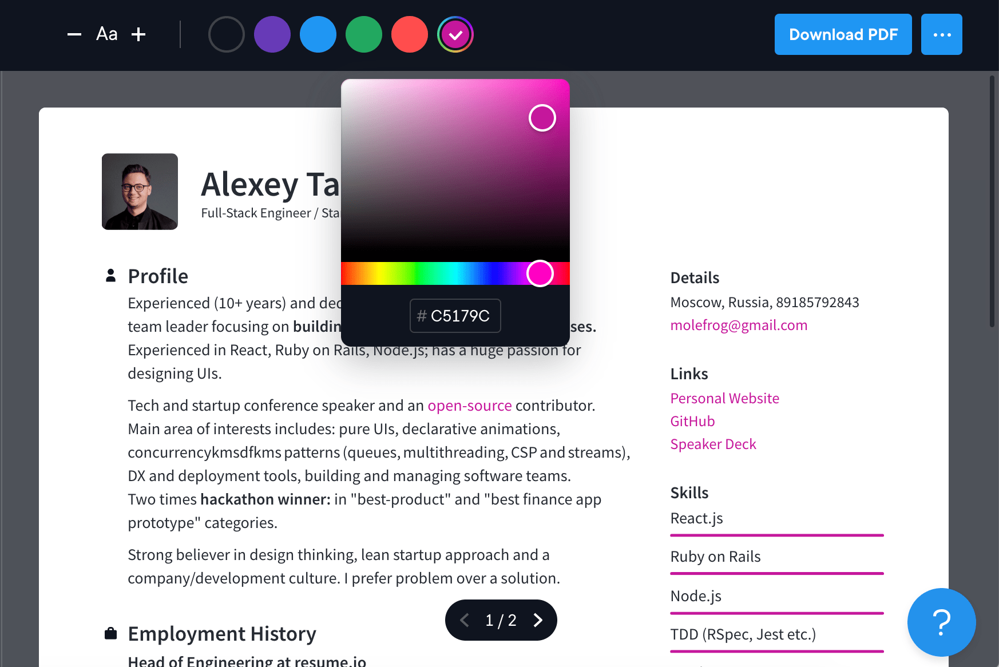

<div align="center">
  <a href="https://omgovich.github.io/react-colorful">
    
  </a>
</div>

<div align="center">
  <a href="https://npmjs.org/package/react-colorful">
    
  </a>
  <a href="https://travis-ci.org/omgovich/react-colorful">
    
  </a>
  <a href="https://npmjs.org/package/react-colorful">
    
  </a>
  <a href="https://bundlephobia.com/result?p=react-colorful">
    
  </a>
  <a href="https://npmjs.org/package/react-colorful">
    
  </a>
</div>

<div align="center">
  <strong>react-colorful</strong> is a tiny color picker component for modern React apps.
</div>

## Features

- **Small**: Just 1,5 KB (minified and gzipped). [Size Limit](https://github.com/ai/size-limit) controls the size.
- **Fast**: Built with hooks and functional components only.
- **Bulletproof**: Written in strict TypeScript and covered by 20+ tests.
- **Simple**: The interface is straight forward and easy to use.
- **Mobile-friendly**: Works well on mobile devices and touch screens.
- **No dependencies**

## Live demos

- [Website](https://omgovich.github.io/react-colorful)
- [CodeSandbox](https://codesandbox.io/s/react-colorful-demo-u5vwp)

## Install

```
npm install react-colorful --save
```

## Usage

```js
import ColorPicker from "react-colorful";
import "react-colorful/dist/index.css";

const YourComponent = () => {
  const [color, setColor] = useState("#aabbcc");
  return <ColorPicker color={color} onChange={setColor} />;
};
```

## Supported color models

The default **react-colorful**'s input/output format is a HEX string (like `#ffffff`). In case if you need another color model, we provide 5 additional color picker bundles.

<details>
  <summary>How to use another color model</summary>

#### Available pickers

| Import path                  | Value example                | Size (gzipped) |
| ---------------------------- | ---------------------------- | -------------- |
| `"react-colorful/rgb"`       | `{ r: 255, g: 255, b: 255 }` | ~1,4 KB        |
| `"react-colorful/rgbString"` | `"rgb(255, 255, 255)"`       | ~1,5 KB        |
| `"react-colorful/hsl"`       | `{ h: 0, s: 0, l: 100 }`     | ~1,2 KB        |
| `"react-colorful/hslString"` | `"hsl(0, 0%, 100%)"`         | ~1,3 KB        |
| `"react-colorful/hsv"`       | `{ h: 0, s: 0, v: 100 }`     | ~1,2 KB        |

#### Code example

```js
import RgbColorPicker from "react-colorful/rgb";
import "react-colorful/dist/index.css";

const YourComponent = () => {
  const [color, setColor] = useState({ r: 50, g: 100, b: 150 });
  return <RgbColorPicker color={color} onChange={setColor} />;
};
```

[Live demo →](https://codesandbox.io/s/react-colorful-rgb-o9q0t)

</details>

## Overriding styles

The easiest way to tweak react-colorful is to create another stylesheet to override the default styles.

```css
.react-colorful {
  height: 250px;
}
.react-colorful__saturation {
  bottom: 30px;
  border-radius: 3px 3px 0 0;
}
.react-colorful__hue {
  height: 30px;
  border-radius: 0 0 3px 3px;
}
.react-colorful__saturation-pointer {
  border-radius: 5px;
}
.react-colorful__hue-pointer {
  border-radius: 2px;
  width: 15px;
  height: inherit;
}
```

[See examples →](https://codesandbox.io/s/react-colorful-customization-demo-mq85z?file=/src/styles.css)

## How to paste or type a color?

As you probably noticed the color picker itself doesn't include an input field, but don't worry if you need one. **react-colorful** is a modular library that allows you to build any picker you need. Since `v2.1` we provide an additional component that works perfectly in pair with our color picker.

<details>
  <summary>How to use <code>HexInput</code></summary><br />

```diff
import ColorPicker from "react-colorful";
+import HexInput from "react-colorful/HexInput";
import "react-colorful/dist/index.css";

const YourComponent = () => {
  const [color, setColor] = useState("#aabbcc");
  return (
    <div>
      <ColorPicker color={color} onChange={setColor} />
+     <HexInput color={color} onChange={setColor} />
    </div>
  );
};
```

[Live demo →](https://codesandbox.io/s/react-colorful-hex-input-demo-0k2fx)

`HexInput` doesn't have any default styles, but accepts all properties that a regular `input` tag does (such as `className`, `placeholder` and `autoFocus`). That means you can place and modify this component as you like. Also, that allows you to combine the color picker and input in different ways.

By the way, `HexInput` is also minimalist-friendly — only 400 bytes gzipped.

</details>

## TypeScript Support

**react-colorful** supports TypeScript and ships with types in the library itself; no need for any other install.

<details>
  <summary>How you can get the most from our TypeScript support</summary><br />
  
While not only typing its own functions and variables, it can also help you type yours. Depending on the component you're using, you can also import the type that is associated with the component. For example, if you're using our HSL color picker component, you can also import the `HSL` type.

```ts
import HslColorPicker, { HSL }  from "react-colorful/hsl";

const myHslValue: HSL = { h: 0, s: 0, l: 0 };
```

Take a look at [Supported Color Models](#supported-color-models) for more information about the types and color formats you may want to use.

</details>

## Why react-colorful?

Today each dependency drags more dependencies and increases your project’s bundle size uncontrollably. But size is very important for everything that intends to work in a browser.

**react-colorful** is a simple color picker for those who care about their bundle size and client-side performance. It's fast and lightweight because:

- has no dependencies (no risks in terms of vulnerabilities, no unexpected bundle size changes);
- built with hooks and functional components only (no classes and polyfills for them);
- ships only a minimal amount of manually optimized color conversion algorithms (while most of the popular pickers import entire color manipulation libraries that increase the bundle size by more than 10 KB and make your app slower).

To show you the problem that **react-colorful** is trying to solve, we have performed a simple benchmark (using [bundlephobia.com](https://bundlephobia.com)) against popular React color picker libraries:

| Name               | Size (minified)                                                                                                                    | Size (gzipped)                                                                                                                        | Dependencies |
| ------------------ | ---------------------------------------------------------------------------------------------------------------------------------- | ------------------------------------------------------------------------------------------------------------------------------------- | ------------ |
| **react-colorful** | [](https://bundlephobia.com/result?p=react-colorful)    | [](https://bundlephobia.com/result?p=react-colorful)    | **0**        |
| react-color        | [](https://bundlephobia.com/result?p=react-color)             | [](https://bundlephobia.com/result?p=react-color)             | 6            |
| react-input-color  | [](https://bundlephobia.com/result?p=react-input-color) | [](https://bundlephobia.com/result?p=react-input-color) | 7            |
| rc-color-picker    | [](https://bundlephobia.com/result?p=rc-color-picker)     | [](https://bundlephobia.com/result?p=rc-color-picker)     | 5            |

## Companies using react-colorful

<details>
  <summary><a href="https://resume.io">Resume.io</a> — online resume builder with over 7,800,000 users worldwide</summary>

  <a href="https://resume.io/">
    
  </a>
</details>

## Roadmap

- [x] Additional modules to support different RGB, HSL and HSV color models
- [x] HEX input component
- [x] TypeScript support
- [x] Rewrite the codebase to TypeScript
- [ ] Alpha channel support (RGBA and HSLA color models)
- [ ] Preact support
