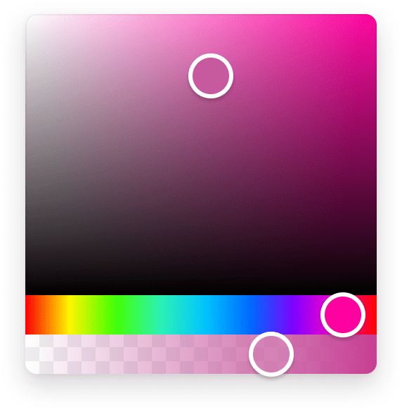

<div align="center">
  <a href="https://omgovich.github.io/react-colorful">
    
  </a>
</div>

<div align="center">
  <a href="https://npmjs.org/package/react-colorful">
    
  </a>
  <a href="https://travis-ci.org/omgovich/react-colorful">
    
  </a>
  <a href="https://npmjs.org/package/react-colorful">
    
  </a>
  <a href="https://npmjs.org/package/react-colorful">
    
  </a>
  
  
</div>

<div align="center">
  <strong>react-colorful</strong> is a tiny color picker component for modern React apps.
</div>

## Features

- **Small**: Just 1,5 KB (minified and gzipped). [Size Limit](https://github.com/ai/size-limit) controls the size.
- **Fast**: Built with hooks and functional components only.
- **Simple**: The interface is straight forward and easy to use.
- **Mobile-friendly**: Works well on mobile devices and touch screens.
- **No dependencies**

## Live demos

- [Website](https://omgovich.github.io/react-colorful)
- [CodeSandbox](https://codesandbox.io/s/react-colorful-demo-u5vwp)

## Install

```
npm install react-colorful --save
```

## Usage

```js
import ColorPicker from "react-colorful";
import "react-colorful/dist/index.css";

const YourComponent = () => {
  const [color, setColor] = useState("#aabbcc");
  return <ColorPicker hex={color} onChange={setColor} />;
};
```

## Overriding styles

The easiest way to tweak react-colorful is to create another stylesheet to override the default styles.

```css
.react-colorful {
  height: 250px;
}
.react-colorful__saturation {
  bottom: 30px;
  border-radius: 3px 3px 0 0;
}
.react-colorful__hue {
  height: 30px;
  border-radius: 0 0 3px 3px;
}
.react-colorful__saturation-pointer {
  border-radius: 5px;
}
.react-colorful__hue-pointer {
  border-radius: 2px;
  width: 15px;
  height: inherit;
}
```

## Why react-colorful?

Today each dependency drags more dependencies and increasing your project’s bundle size uncontrollably. But size is especially important when your package is intended to work in a browser. **react-colorful** is a simple minimalist-friendly color picker React-component for those who care about their bundle size and client-side performance.

To show you the problem that **react-colorful** is trying to solve, we have performed a simple benchmark (using [size-limit](https://github.com/ai/size-limit)) against popular React color picker libraries:

| Name                     | Size (minified) | Size (gzipped) | Dependencies |
| ------------------------ | --------------- | -------------- | ------------ |
| react-colorful v1.2.1    | **4 KB**        | **1,5 KB**     | **0**        |
| react-color v2.18.1      | 165 KB          | 40,6 KB        | 6            |
| react-input-color v3.0.1 | 59 KB           | 19,1 KB        | 7            |
| rc-color-picker v1.2.6   | 117 KB          | 32,4 KB        | 5            |
